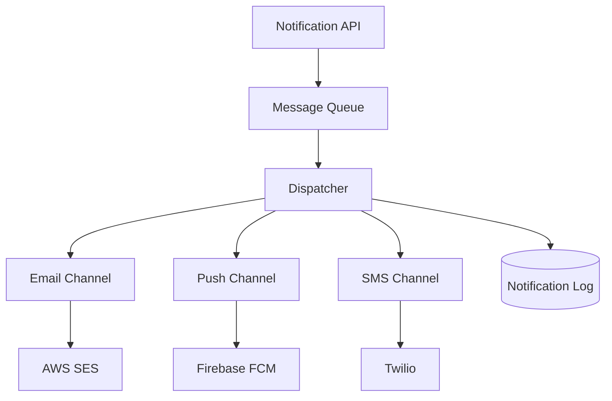

# /arch — Example

## Input

```
We need a notification system that sends emails, push notifications, and SMS.
Expected volume: 50k notifications/day. Team of 3 engineers. Must support
adding new channels later without code changes to the core.
```

## Expected Output

### Architecture: Notification System

#### Components



#### Design Decisions

**Event-driven with a message queue** (vs. synchronous processing)
- At 50k/day (~0.6/sec avg, spiky), a queue absorbs bursts and provides retry
- Alternatives: direct API calls (simpler but no retry), cron batch (too latent)
- Recommendation: SQS or Redis-backed queue — both proven, team likely knows one

**Channel plugin pattern** (vs. hardcoded channels)
- Each channel implements a `NotificationChannel` interface: `send(recipient, content)`
- New channels are registered in config, not code — satisfies the extensibility requirement
- Alternatives: strategy pattern (similar but requires code deploy), webhook-based (too complex for 3 engineers)

**Single dispatcher service** (vs. per-channel workers)
- At 50k/day, a single service with channel routing is sufficient
- Split into per-channel workers only if one channel becomes a bottleneck
- Keeps operational overhead low for a team of 3

#### Risks

- **Deliverability**: Email reputation takes time to build — start with SES sandbox early
- **Duplicate sends**: Queue retry can cause duplicates — add idempotency key per notification
- **Vendor lock-in**: Abstract behind the channel interface from day one

#### Milestones

1. **Week 1**: Queue + dispatcher + email channel (covers 80% of use cases)
2. **Week 2**: Push notifications + notification log/status tracking
3. **Week 3**: SMS channel + rate limiting + monitoring dashboard
