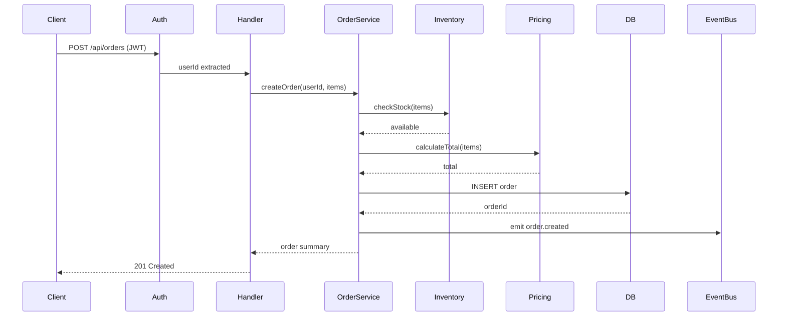

# /trace — Example

## Input

```
POST /api/orders
```

## Expected Output

### Trace

1. `src/middleware/auth.ts:12` — Validates JWT token, extracts `userId`
2. `src/middleware/rateLimit.ts:8` — Checks rate limit (100 req/min per user)
3. `src/routes/orders.ts:24` — Route handler, parses request body
4. `src/validators/order.ts:15` — Validates order schema (items, quantities, address)
5. `src/services/OrderService.ts:42` — `createOrder()` — orchestrates the flow
6. `src/services/InventoryService.ts:88` — Checks stock availability for each item
7. `src/services/PricingService.ts:31` — Calculates totals, applies discounts
8. `src/repositories/OrderRepository.ts:19` — Inserts order into `orders` table
9. `src/services/OrderService.ts:67` — Emits `order.created` event
10. `src/routes/orders.ts:38` — Returns 201 with order ID and summary

### Sequence Diagram



### Side Effects

- Event `order.created` emitted to EventBus (consumed by email and analytics services)
- Rate limit counter incremented for userId
- Audit log entry written at `src/middleware/audit.ts:20`

### Error Paths

- **Invalid JWT** → 401 at step 1
- **Rate limited** → 429 at step 2
- **Invalid body** → 400 at step 4
- **Out of stock** → 409 at step 6, order not created
- **DB failure** → 500 at step 8, transaction rolled back
